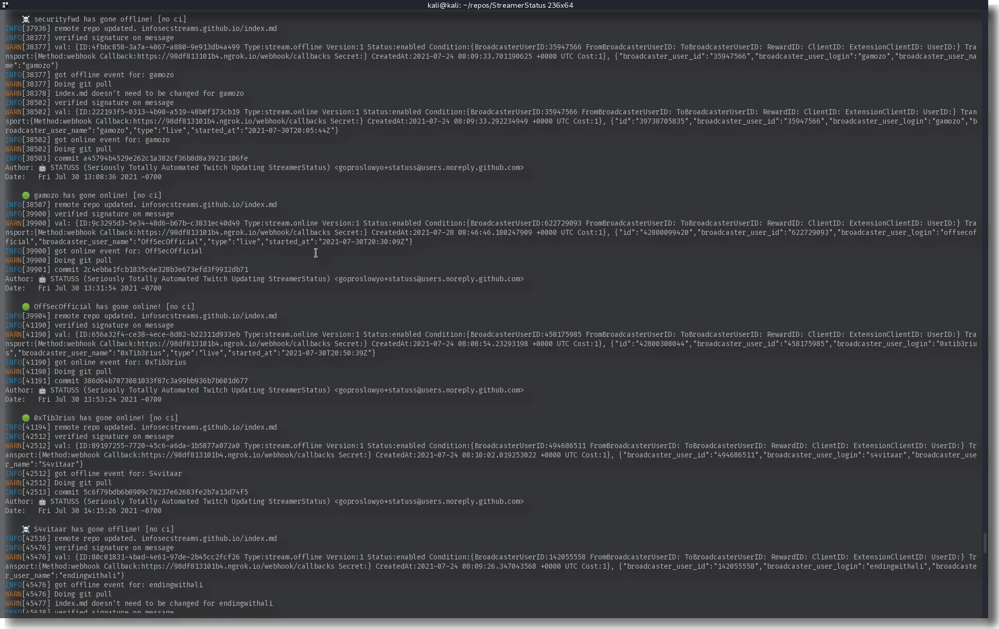

# StreamStatus

This program updates streamer's status on the [hacklist](https://infosecstreams.github.io/) by receiving Twitch EventSub webhook requests, editing the repo markdown, and committing the changes back to GitHub.



You need to subscribe to `stream.{offline,online}` events from the Twitch EventSub API. This program listens on `http://0.0.0.0:SS_PORT/webhook/callbacks` for webhook requests from twitch containing JSON EventSub data:

```json
{
  "subscription": {
    "id": "607e9634-8600-450c-948e-8cc1380fa9fe",
    "status": "enabled",
    "type": "stream.offline",
    "version": "1",
    "condition": { "broadcaster_user_id": "555942272" },
    "transport": {
      "method": "webhook",
      "callback": "https://98cf813101b4.ngrok.io/webhook/callbacks"
    },
    "created_at": "2021-07-24T08:09:34.816454134Z",
    "cost": 1
  },
  "event": {
    "broadcaster_user_id": "555942272",
    "broadcaster_user_login": "goproslowyo",
    "broadcaster_user_name": "GoProSlowYo"
  }
}
```

Since Twitch removed "Hack the Box" and "TryHackMe" as categories we just look for various Cybersecurity related tags to guess if it's content we want to show as "online".

This is the current list of games and (optional) tags in the code:

```golang
var VALID_GAMES = []string{
  "just chatting",
  "science \u0026 technology",
  "software and game development",
  "talk shows \u0026 podcasts",
}

var OPTIONAL_TAGS = []string{
  "ctf", "capturetheflag",
  "htb", "hackthebox",
  "thm", "tryhackme",
  "infosec", "cybersecurity", "informationsecurity",
  "hacker", "hacking", "bugbounty", "pentest", "security",
  "reverseengineering", "malware", "malwareanalysis",
  "iss", "infosecstream", "infosecstreams", "infosecstreamer", "infosecstreamers",
}
```

The code is ~~bad~~ okay-ish and I feel ~~bad~~ okay-ish.

## Build It

Directly with go:

```shell
go mod tidy
go build -mod vendor -ldflags="-s -w" -o StreamStatus ./...
```

---

Or, build a docker image:

```shell
make build-ss
# or
docker build -t streamstatus:dev .
```

## Use It

1. Update the env vars in streamstatus.env for docker-compose (check streamstatus.env.example).
1. Run it in docker:

```shell
$ make ss-run
INFO[0000] server starting on :8080
```

Run directly with ENV vars:

```shell
SS_PORT=3000 SS_SECRETKEY=secret SS_TOKEN=token SS_USERNAME=username TW_CLIENT_ID=client_id TW_CLIENT_SECRET=client_secret SS_PUSHBULLET_APIKEY=abc123 SS_PUSHBULLET_DEVICES=phone ./StreamStatus
```

---

Or, export required ENV vars:

```shell
# Port to listen on
export SS_PORT=3000
# Secret key to HMAC EventSub message
export SS_SECRETKEY=secret
# GitHub personal access token
export SS_TOKEN=token
# GitHub username
export SS_USERNAME=username
# Twitch Client ID
export TW_CLIENT_ID=client_id
# Twitch Secret
export TW_CLIENT_SECRET=client_secret
# Pushbullet API Key
export SS_PUSHBULLET_APIKEY=myAPIkey
# Pushbullet devices (comma separated) to send notifications to
export SS_PUSHBULLET_DEVICES=myDevice,anotherDevice

# Run:
./StreamStatus
```

---

Or, if you built the docker image:

```shell
docker run --rm -it -e SS_PORT=9001 -e SS_SECRETKEY=secret -e SS_TOKEN=token -e SS_USERNAME=username -e TW_CLIENT_ID=client_id -e TW_CLIENT_SECRET=client_secret -e SS_PUSHBULLET_APIKEY=abc123 -e SS_PUSHBULLET_DEVICES=phone streamstatus:dev
```

---

Or, use `docker-compose` after setting environment variables in `streamstatus.env`

```shell
docker-compose --build up
# or to background it:
docker-compose --build up -d
```
